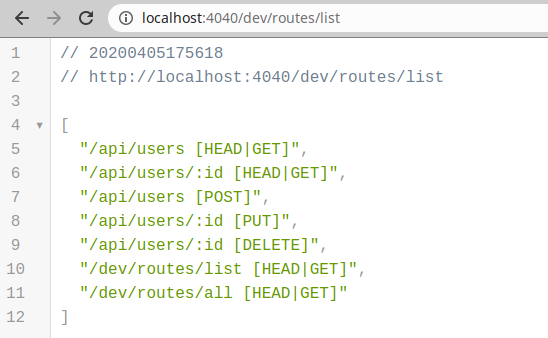
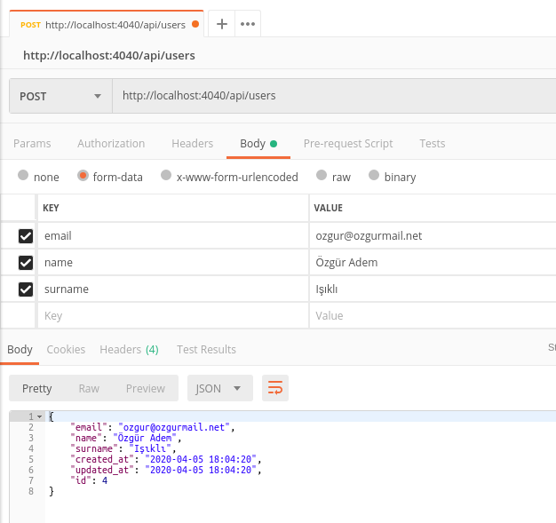

# AdonisX

[](https://travis-ci.org/adonisx/adonisx)
[](https://sonarcloud.io/dashboard?id=ozziest_apix)

AdonisX is a fastest way to create simple Rest API by defining database models and their relations. AdonisX is built on [AdonisJs](https://adonisjs.com/), and it's awesome ORM library, [Lucid](https://adonisjs.com/docs/4.1/lucid). **But this library is still under development**. 

## Getting Started

You can create a new AdonisX project structure by using following commands;

```bash
$ yarn global add @adonisjs/cli
$ adonis new my-api
$ cd ./my-api
$ yarn add @ozziest/AdonisX mysql
```

Add AdonisXProvider to your `app.js` under `start` folder;

```js
const providers = [
  // ...
  // ...
  // ...
  '@adonisjs/validator/providers/ValidatorProvider',
  '@ozziest/AdonisX/providers/AdonisXProvider'
]
```

Update your `namedMiddleware` object under `start/kernel.js`;

```js
const namedMiddleware = {
  idFilter: 'AdonisX/Middleware/IdFilter'
}
```

Then you can edit your `.env` file for database connection like this;

```
HOST=localhost
PORT=3333
NODE_ENV=development
APP_URL=http://${HOST}:${PORT}
APP_KEY=this-is-my-secret
HASH_DRIVER=bcrypt
DB_CONNECTION=mysql
DB_HOST=localhost
DB_USER=root
DB_PASSWORD=your-secret-password
DB_DATABASE=your-database
```

Now, we are ready to create a new migration file to create a table on database;

```bash
$ adonis make:migration Users
```

Under the folder `database/migration`, you should update the migration file like this;

```js
'use strict'

const Schema = use('Schema')

class UsersSchema extends Schema {
  up () {
    this.create('users', (table) => {
      table.increments()
      table.string('email', 100).notNullable().unique()
      table.string('name', 50).notNullable()
      table.string('surname', 50).notNullable()
      table.integer('age').nullable()
      table.timestamps()
    })
  }

  down () {
    this.drop('users')
  }
}

module.exports = UsersSchema
```

When we execute `adonis migration:run`, we will have a `users` table on database. In means that we can create a basic [Lucid Model](https://adonisjs.com/docs/4.1/lucid#_introduction) for your `users` table under `app/Models` folder;

```js
'use strict'

const XModel = use('AdonisX/Models/XModel')

class Users extends XModel {
  static get table () {
    return 'users'
  }

  static get fillable () {
    return ['email', 'name', 'surname', 'age']
  }
}

module.exports = Users
```

Create a new controller under `App/Controllers/Http/MainController.js`;

```js
'use strict'

const XController = use('AdonisX/Controllers/XController')

class MainController extends XController {
}

module.exports = MainController
```

After then, we can execute the application with following command;

```bash
$ yarn run start

yarn run v1.22.4
$ node server.js
info: serving app on http://127.0.0.1:3333
```


Tata! 🎉 With `http://localhost:3333/dev/routes/list` request, you can see all possible routes which you can use. Our API is ready to use now! Come on, test it with your client applications like Postman.



This is an example request to create a new record on database;



## Philosophy

The aim of the AdonisX is very simple, creating a simple API server as quick as we can. In order to this, we created a distributed [Service Provider](https://adonisjs.com/docs/4.1/service-providers) for AdonisJs. AdonisX is the name of this distributed Service Provider.

This service provider (AdonisX) scans your [Lucid](https://adonisjs.com/docs/4.1/lucid#_introduction) models, analyzes all relationships between them, create all REST API routes by [best practices](https://hackernoon.com/restful-api-designing-guidelines-the-best-practices-60e1d954e7c9), and finally, handles all requests and creates responses **automatically**.

In the end of the day, with this way, you will not have to write all Rest API codes over and over.

The important point in here, is AdonisX is designed for simple Rest APIs. But again, it helps to implement you to write your own business logics by giving you some triggers for all key actions. For example, you can create a trigger to be triggerred before for every new insert on a table. In there, you can do whatever you want in it.

## Documentation

### 1. Directory Structure

The project's directory structure is almost same with AdonisJs;

```
.
├── app/
  ├── ...
├── config/
  ├── app.js
  ├── database.js
  └── ...
├── database/
  ├── migrations/
  ├── seeds/
├── start/
  ├── app.js
  ├── kernel.js
  └── routes.js
  └── triggers.js
├── test/
├── ace
├── server.js
└── package.json
```

> You would see some differences after you started to use it although it is almost same with AdonisJs.

### 2. Models

#### 2.1. Basic Structure

Model definitions should be almost like [Lucid Model](https://adonisjs.com/docs/4.1/lucid). You can use all features of Lucid Models. But to get more, you should extend your model from `AdonisX/Models/XModel`;


```js
const XModel = use('AdonisX/Models/XModel')

class Users extends XModel {
  static get table () {
    return 'users'
  }
}

module.exports = Users
```

#### 2.2. Fillable Fields

In order to allow create and update methods, you should define which columns should be editable by users. 

```js
const XModel = use('AdonisX/Models/XModel')

class Users extends XModel {
  static get table () {
    return 'users'
  }

  static get fillable () {
    return ['email', 'name', 'surname', 'age']
  }
}

module.exports = Users
```

In this example, **email**, **name**, **surname** and **age** columns can be editable by users in **create** and **update** methods. If you have a field like **my_secret** and you don't want to make it fillable by users, you **shouldn't** add it to this array. Then it will be safe and only editable by yourself.

#### 2.3. Form Validations

Everybody needs form validation in their API. AdonisX uses [Indicative](https://indicative-v5.adonisjs.com/) like [AdonisJs](https://adonisjs.com/docs/4.1/validator). The thing you should to define validations, you should add a validations method to your model;

```js
const XModel = use('AdonisX/Models/XModel')

class Users extends XModel {
  static get table () {
    return 'users'
  }

  static get validations () {
    return {
      email: 'required|email',
      name: 'required|max:50',
      surname: 'required|max:50',
      age: 'max:100'
    }
  }
}
module.exports = Users
```

#### 2.4. Allowed Methods

Sometimes, you will need to deny some HTTP request for some models. In order to define it, you can add following method to your model. As defaults, all methods are allowed.

```js
const XModel = use('AdonisX/Models/XModel')

class Users extends XModel {
  static get table () {
    return 'users'
  }

  static get actions () {
    return ['GET', 'POST', 'PUT', 'DELETE']
  }
}
module.exports = Users
```

#### 2.4. Custom Middlewares

To add your logics to some routes for some models, you may use following statements in model structure;

```js
const XModel = use('AdonisX/Models/XModel')

class Users extends XModel {
  static get table () {
    return 'users'
  }

  static get middlewares () {
    return [
      'App/Middleware/CallOnAllRequestsMiddleware',
      { method: 'GET', middleware: 'App/Middleware/CallOnGETMiddleware' }
      { method: 'POST', middleware: 'App/Middleware/CallOnPOSTMiddleware' }
    ]
  }
}
module.exports = Users
```

With this, you can add an [AdonisJs Middleware](https://adonisjs.com/docs/4.1/middleware) for your model routes.

#### 2.5. Recursive Resources

Creating a recursive model is very simple with AdonisX. Just add following relationship structure and it is done! You can use a recursive resource with this way.

```js
const XModel = use('AdonisX/Models/XModel')

class Category extends XModel {
  static get table () {
    return 'categories'
  }

  static get fillable () {
    return ['title']
  }

  categories () {
    return this.hasMany('App/Models/Category')
  }

  category () {
    return this.hasOne('App/Models/Category')
  }
}

module.exports = Category
```

When you define a recursive resource like this, you will have following routes to access the resource;

- api/categories [GET]
- api/categories/:id [GET]
- api/categories [POST]
- api/categories/:id [PUT]
- api/categories/:id [DELETE]
- api/categories/:categoryId/children [GET]
- api/categories/:categoryId/children/:id [GET]
- api/categories/:categoryId/children [POST]
- api/categories/:categoryId/children/:id [PUT]
- api/categories/:categoryId/children/:id [DELETE]

### 3. Triggers & Events

You may use **Triggers** and **Events** in order to add your business logic. To use them, you should use `triggers.js` or `events.js` under **start** folder. **Events** are actually AdonisJS' features and you can read its documentation in [here](https://adonisjs.com/docs/4.1/events). But also, we added **Triggers** to our structure to have more control over database actions such as get, create, update and delete.

The main difference between **triggers** and **events** is; events are asynchronous. It means that if you are using trigger and handle an the action, HTTP request cycle waits for your responses. But in events, when you handle an action, HTTP requests cycle keeps working and return a responses. So that, if you want to send an e-mail to the user, you should use **events**. On the other hand, if you want to be involved to the query or any business logics in HTTP request cycle, you should use **triggers**.

#### 3.1. Trigger

```js
const Trigger = use('Trigger')

Trigger.on('onBeforeCreateUser', 'UserTrigger.onBeforeCreate')
```

To define a trigger for a model, you should use this structure. In this structure, there are two argument which you can use;

- `when`: When your method will be triggerred.
- `method`: Which method will be triggered.

In this example, methods will be triggers in **UserTrigger** file for before create a new record on `User` model.

This is how `UserTrigger.js` looks under `app` folder;

```js
class UserTrigger {
  async onBeforeCreate ({ request, params, data }) {
    // Implement you business logic in here...
  }
}

module.exports = UserTrigger
```

In this structure, you can handle almost every query actions on models. You should look at following tables;

| Triggername{Model}     | Variables                    |
|------------------------|------------------------------|
| onBeforeCreate{User}   | request, params, data        |
| onBeforeUpdate{User}   | request, params, item        |
| onBeforeDelete{User}   | request, params, query       |
| onBeforePaginate{User} | query                        |
| onBeforeShow{User}     | query                        |
| onAfterCreate{User}    | request, params, data, item  |
| onAfterUpdate{User}    | request, params, item        |
| onAfterDelete{User}    | item                         |
| onAfterPaginate{User}  | result                       |
| onAfterShow{User}      | item                         |

#### 3.2. Events

Events have same structure with triggers. In `events.js`, you can define your event like this;

```js
const Event = use('Event')

Event.on('onAfterCreateUser', 'UserEvent.onAfterCreate')
```

Then you should crete a file which is called as `UserEvent` under the `app/Events` folder. Catching an event is simple like this;

```js
class UserEvent {
  onAfterCreate ({ request, params, data, item }) {
    // Implement you business logic in here...
  }
}

module.exports = UserEvent
```

| Eventname{Model}       | Variables                    |
|------------------------|------------------------------|
| onBeforeCreate{User}   | request, params, data        |
| onBeforeUpdate{User}   | request, params, item        |
| onBeforeDelete{User}   | request, params, query       |
| onBeforePaginate{User} | query                        |
| onBeforeShow{User}     | query                        |
| onAfterCreate{User}    | request, params, data, item  |
| onAfterUpdate{User}    | request, params, item        |
| onAfterDelete{User}    | item                         |
| onAfterPaginate{User}  | result                       |
| onAfterShow{User}      | item                         |

### 4. Queries

While you are fetching any data from api server (Paginate and Show), you can add more query options to get best result about what you want.

#### 4.1. Fields

In order to get only specefic fields, you may use a query like following statement;

```
/api/users?fields:id,name,surname
```

This request is equal on SQL;

```sql
SELECT `id`, `name`, `surname`
```

#### 4.2. Sorting

You may sorting your results by your selections for multiple columns;

```
/api/users?sort=surname,-name
```

This request is equal on SQL;

```sql
ORDER BY `surname` ASC, `name` DESC
```

#### 4.3. Limits

While you are fetching data with pagination, you may send `page` and `per_page` variables like this;

```
/api/users?page=2&per_page=25
```

#### 4.4. Where Conditions

AdonisX has several where conditions to use.

##### 4.4.1. Simple Query Expression

```
/api/users?q={ "id": 1 }
```

```sql
WHERE `id` = 1
```

##### 4.4.2. Multiple Conditions

```
/api/users?q=[ {"name": "John"}, {"surname": "Locke" } ]
```

```sql
WHERE `name` = 'John' AND `surname` = 'Locke'
```

##### 4.4.3. OR Expression On Multiple Conditions

```
/api/users?q=[ {"name": "John"}, {"$or.surname": "Locke" } ]
```

```sql
WHERE `name` = 'John' OR `surname` = 'Locke'
```

##### 4.4.4. Recursive Conditions

```
/api/users?q=[ [{"name": "John"}, {"$or.surname": "Locke" }], [{"$or.age": 18}, {"$or.id": 666 }] ]
```

```sql
WHERE
  (
    `name` = 'John' OR `surname` = 'Locke'
  )
  OR (
    `age` = 18 OR `id` = 666
  )
```

##### 4.4.5. Operators

You may use following operators in all of your queries by adding the operator to the end of your field name.

| Operator        | Request `/api/users?q=`        | SQL (MySQL)              |
|-----------------|--------------------------------|--------------------------|
| `$not`          | `{"id.$not": 10}`              | `id <> 10`               |
| `$gt`           | `{"id.$gt": 10}`               | `id > 10`                |
| `$gte`          | `{"id.$gte": 10}`              | `id >= 10`               |
| `$lt`           | `{"id.$lt": 10}`               | `id < 10`                |
| `$lte`          | `{"id.$lte": 10}`              | `id <= 10`               |
| `$like`         | `{"name.$like": "Foo%"}`       | `name LIKE 'Foo%'`       |
| `$notLike`      | `{"name.$notLike": "Foo%"}`    | `name NOT LIKE 'Foo%'`   |
| `$in`           | `{"id.$in": [1,2]}`            | `id IN (1, 2)`           |
| `$notIn`        | `{"id.$notIn": [1,2]}`         | `id NOT IN (1,2 )`       |
| `$between`      | `{"id.$between": [1, 10]}`     | `id BETWEEN (1, 10)`     |
| `$notBetween`   | `{"id.$notBetween": [1, 10]}`  | `id NOT BETWEEN (1, 10)` |
| `$null`         | `{"id.$null": null}`           | `id IS NULL`             |
| `$notNull`      | `{"id.$notNull": null}`        | `id IS NOT NULL`         |

#### 4.5. Relationships

In order to get related models in pagination or show methods, you may use following statements;

##### 4.5.1. Multiple Relations

```
/api/users?with=posts,tokens
```

```json
{
  "id": 1,
  "username": "my-username",
  "posts": [
    {
      "id": 1,
      "user_id": 1
    }
  ],
  "tokens": [
    {
      "id": 1,
      "user_id": 1
    }
  ]
}
```

##### 4.5.2. Only Dedicated Fields

```
/api/users?with=posts{id|user_id|title}
```

```json
{
  "id": 1,
  "username": "my-username",
  "posts": [
    {
      "id": 1,
      "user_id": 1,
      "title": "Awesome post title"
    }
  ]
}
```

##### 4.5.3. Recursive Relationships

```
/api/users?with=posts{id|user_id|title|comments{id|post_id|content}}
```

```json
{
  "id": 1,
  "username": "my-username",
  "posts": [
    {
      "id": 1,
      "user_id": 1,
      "title": "Awesome post title",
      "comments": [
        {
          "id": 1,
          "post_id": 1,
          "content": "Awesome comment on the post"
        }
      ]
    }
  ]
}
```