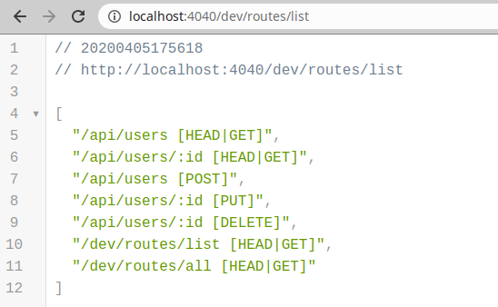
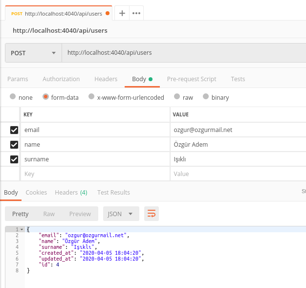

# APIX

APIX is a fastest way to create simple Rest API by defining database models and their relations. It is built on [AdonisJs](https://adonisjs.com/) and it's awesome ORM library, [Lucid](https://adonisjs.com/docs/4.1/lucid).

## Getting Started

You can create a new APIX project structure by using following commands;

```bash
$ yarn global add nodemon aftershift/apix
$ apix new api
$ cd ./api
```

Then you can edit your `.env` file for database connection like this;

```
HOST=localhost
PORT=4040
NODE_ENV=development
APP_URL=http://${HOST}:${PORT}
APP_KEY=this-is-my-secret
HASH_DRIVER=bcrypt
DB_CONNECTION=mysql
DB_HOST=localhost
DB_USER=root
DB_PASSWORD=your-secret-password
DB_DATABASE=your-database
```

Now, we are ready to create a new migration file to create a table on database;

```bash
$ adonis make:migration Users
```

Under the folder `database/migration`, you should update the migration file like this;

```js
'use strict'

const Schema = use('Schema')

class UsersSchema extends Schema {
  up () {
    this.create('users', (table) => {
      table.increments()
      table.string('email', 100).notNullable().unique()
      table.string('name', 50).notNullable()
      table.string('surname', 50).notNullable()
      table.integer('age').nullable()
      table.timestamps()
    })
  }

  down () {
    this.drop('users')
  }
}

module.exports = UsersSchema
```

When we execute `adonis migration:run`, we will have a `users` table on database. In means that we can create a basic [Lucid Model](https://adonisjs.com/docs/4.1/lucid#_introduction) for your `users` table under `app/Models` folder;

```js
'use strict'

const XModel = use('APIX/Models/XModel')

class Users extends XModel {
  static get table () {
    return 'users'
  }

  static get fillable () {
    return ['email', 'name', 'surname', 'age']
  }
}

module.exports = Users
```


After then, we can execute the application with following command;

```bash
$ yarn run serve

yarn run v1.22.4
nodemon server.js
[nodemon] 2.0.2
[nodemon] to restart at any time, enter `rs`
[nodemon] watching dir(s): *.*
[nodemon] watching extensions: js,mjs,json
[nodemon] starting `node server.js`
info: serving app on http://localhost:4040
```


Tata! 🎉 With `http://localhost:4040/dev/routes/list` request, you can see all possible routes which you can use. Our API is ready to use now! Come on, test it with your client applications like Postman.



This is an example request to create a new record on database;



## Philosophy

The aim of the APIX is very simple, creating a simple API server as quick as we can. In order to this, we created a distributed [Service Provider](https://adonisjs.com/docs/4.1/service-providers) for AdonisJs. APIX is the name of this distributed Service Provider.

This service provider (APIX) scans your [Lucid](https://adonisjs.com/docs/4.1/lucid#_introduction) models, analyzes all relationships between them, create all REST API routes by [best practices](https://hackernoon.com/restful-api-designing-guidelines-the-best-practices-60e1d954e7c9), and finally, handles all requests and creates responses **automatically**.

In the end of the day, with this way, you will not have to write all Rest API codes over and over.

The important point in here, is APIX is designed for simple Rest APIs. But again, it helps to implement you to write your own business logics by giving you some triggers for all key actions. For example, you can create a trigger to be triggerred before for every new insert on a table. In there, you can do whatever you want in it.

## Documentation

### 1. Directory Structure

The project's directory structure is almost same with AdonisJs;

```
.
├── app/
  ├── ...
├── config/
  ├── app.js
  ├── database.js
  └── ...
├── database/
  ├── migrations/
  ├── seeds/
├── start/
  ├── app.js
  ├── kernel.js
  └── routes.js
  └── triggers.js
├── test/
├── ace
├── server.js
└── package.json
```

> You would see some differences after you started to use it although it is almost same with AdonisJs.

### 2. Models

#### 2.1. Basic Structure

Model definitions should be almost like [Lucid Model](https://adonisjs.com/docs/4.1/lucid). You can use all features of Lucid Models. But to get more, you should extend your model from `APIX/Models/XModel`;


```js
const XModel = use('APIX/Models/XModel')

class Users extends XModel {
  static get table () {
    return 'users'
  }
}

module.exports = Users
```

#### 2.2. Fillable Fields

In order to allow create and update methods, you should define which columns should be editable by users. 

```js
const XModel = use('APIX/Models/XModel')

class Users extends XModel {
  static get table () {
    return 'users'
  }

  static get fillable () {
    return ['email', 'name', 'surname', 'age']
  }
}

module.exports = Users
```

In this example, **email**, **name**, **surname** and **age** columns can be editable by users in **create** and **update** methods. If you have a field like **my_secret** and you don't want to make it fillable by users, you **shouldn't** add it to this array. Then it will be safe and only editable by yourself.

#### 2.3. Form Validations

Everybody needs form validation in their API. APIX uses [Indicative](https://indicative-v5.adonisjs.com/) like [AdonisJs](https://adonisjs.com/docs/4.1/validator). The thing you should to define validations, you should add a validations method to your model;

```js
const XModel = use('APIX/Models/XModel')

class Users extends XModel {
  static get table () {
    return 'users'
  }

  static get validations () {
    return {
      email: 'required|email',
      name: 'required|max:50',
      surname: 'required|max:50',
      age: 'max:100'
    }
  }
}
module.exports = Users
```

#### 2.4. Allowed Methods

Sometimes, you will need to deny some HTTP request for some models. In order to define it, you can add following method to your model. As defaults, all methods are allowed.

```js
const XModel = use('APIX/Models/XModel')

class Users extends XModel {
  static get table () {
    return 'users'
  }

  static get actions () {
    return ['GET', 'POST', 'PUT', 'DELETE']
  }
}
module.exports = Users
```